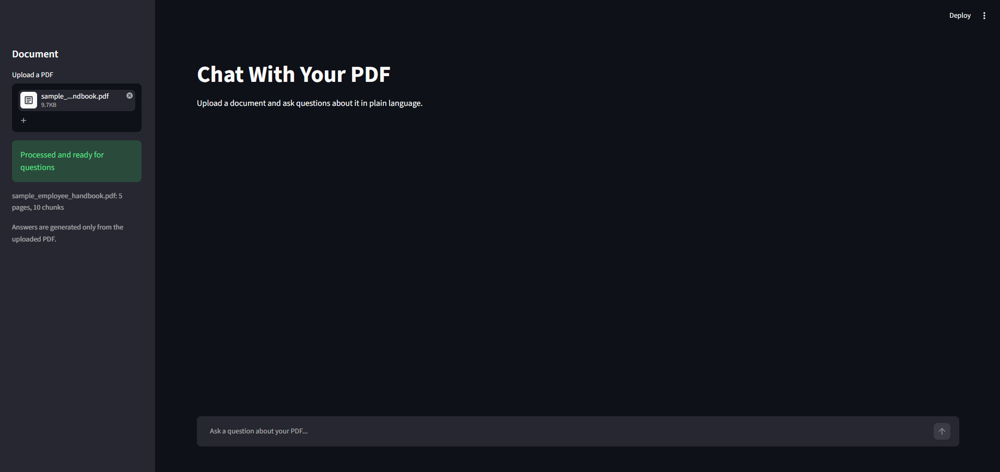
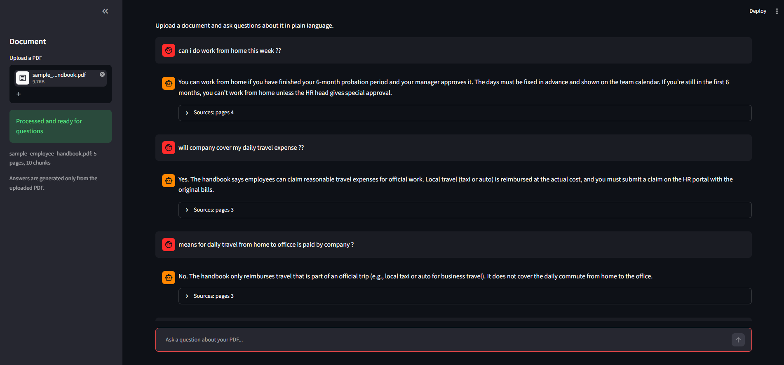
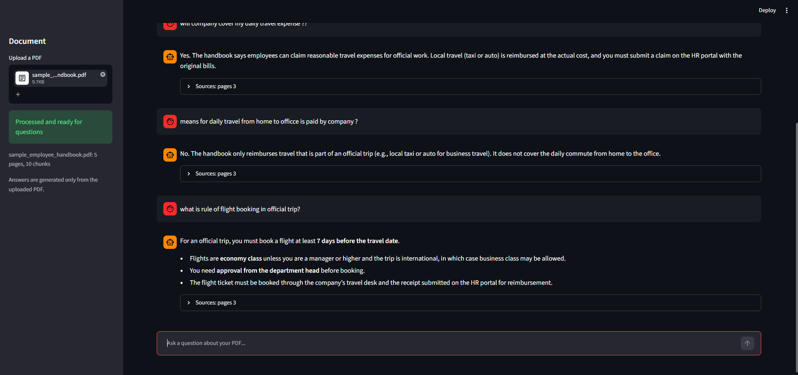
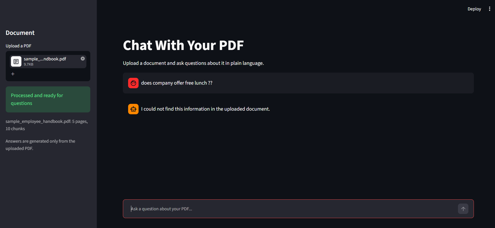
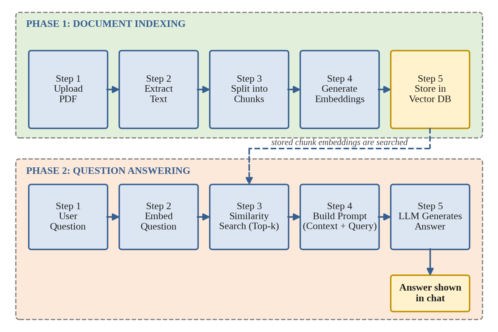

**Live demo:** https://your-link.streamlit.app

# Chat With Your PDF

Ask questions about any PDF and get answers grounded in the document, with page-level sources.

Upload a long document such as a company policy, FAQ or manual, then ask in plain language. The app finds the relevant parts of the PDF and has an LLM answer **only from them**. If the answer is not in the document, it says so instead of guessing.

Built as the project of a 15-day GenAI internship at The SmartBridge Educational Pvt. Ltd. (July 2026).

## Screenshots









## How it works

This is a Retrieval-Augmented Generation (RAG) pipeline in two phases.



**Phase 1: indexing (once per PDF)**
1. `pypdf` reads the text page by page and keeps the page numbers.
2. The text is split into chunks of 1,000 characters with a 200-character overlap.
3. A Sentence-Transformers model (`all-MiniLM-L6-v2`) turns each chunk into an embedding.
4. ChromaDB stores each chunk with its embedding and page number.

**Phase 2: answering (every question)**
1. The question is embedded with the same model.
2. ChromaDB returns the 4 chunks closest in meaning.
3. A prompt is built from those chunks, the last 6 chat messages and the question.
4. A Groq-hosted LLM writes the answer, and the app shows the source pages it used.

## Features

- Works with any text-based PDF
- Answers only from the document, and says so when the answer is not there
- Shows the pages (and the exact passages) behind each answer
- Follow-up questions work, using the recent chat
- Each upload gets its own storage, so several users do not overwrite each other
- Clear messages for scanned PDFs, a missing API key or a failed API request

## Tech stack

| Purpose | Tool |
|---|---|
| Language | Python 3.10+ |
| Web interface | Streamlit |
| PDF reading | pypdf |
| Text splitting | LangChain text splitters |
| Embeddings | Sentence-Transformers (all-MiniLM-L6-v2) |
| Vector database | ChromaDB |
| LLM | Groq API (openai/gpt-oss-20b) |

## Project structure

```
pdf-chatbot/
├── app.py                 # Streamlit page: upload, chat, session state
├── utils/
│   ├── pdf_indexer.py     # read, chunk, embed and store a PDF
│   └── rag_chain.py       # retrieve chunks, build the prompt, call the LLM
├── sample_data/
│   └── sample_employee_handbook.pdf
├── screenshots/
├── docs/architecture.png
├── requirements.txt
├── .env.example
├── LICENSE
└── README.md
```

## Run it locally

```bash
git clone https://github.com/VedPatel16/pdf-chatbot.git
cd pdf-chatbot
python -m venv venv
venv\Scripts\activate          # macOS/Linux: source venv/bin/activate
pip install -r requirements.txt
```

1. Copy `.env.example` to `.env`.
2. Put your free API key from [console.groq.com](https://console.groq.com) in it:
   ```
   GROQ_API_KEY=your_key_here
   GROQ_MODEL=openai/gpt-oss-20b
   ```
3. Start the app:
   ```bash
   streamlit run app.py
   ```

The first run downloads the embedding model (about 90 MB).

## Try it

Upload `sample_data/sample_employee_handbook.pdf` (a made-up company handbook) and ask:

| Question | Expected answer |
|---|---|
| How many casual leaves do employees get? | 12 days per year |
| What is the meal allowance for outstation travel? | Rs. 600 per day |
| Can new joiners work from home? | Not during the first 6 months |
| What is the notice period if I resign? | 60 days (15 days on probation) |
| Does the company offer free lunch? | Not found in the document |

## Design notes

- **Grounded answers:** the prompt tells the model to use only the retrieved text and to reply "not found" otherwise, with a low temperature (0.2) to keep answers close to the document.
- **Honest sources:** the model reports which pages it actually used, so the Sources section does not list unrelated chunks.
- **Follow-ups:** a short question such as "explain that simply" is searched together with the previous question, so it still finds the right pages.
- **Chunking:** 1,000 characters with a 200-character overlap keeps each idea together without cutting sentences at chunk edges.

## Limitations

- Text-based PDFs only; scanned PDFs (OCR), charts and images are not supported
- One document at a time, held in memory (nothing is saved after the app closes)
- Only the top 4 chunks reach the LLM, so "summarize the whole document" works less well than specific questions
- The LLM can still make mistakes, so check the source pages for important answers
- Needs an internet connection and a Groq API key

## Roadmap

- OCR for scanned PDFs
- Several documents per chat
- A multi-client version with an embeddable chat widget for company websites
- Hindi and Gujarati support
- A locally hosted LLM for confidential documents

## License

MIT, see [LICENSE](LICENSE).
